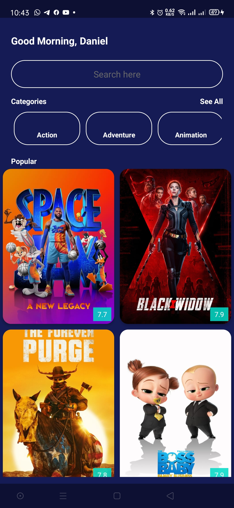
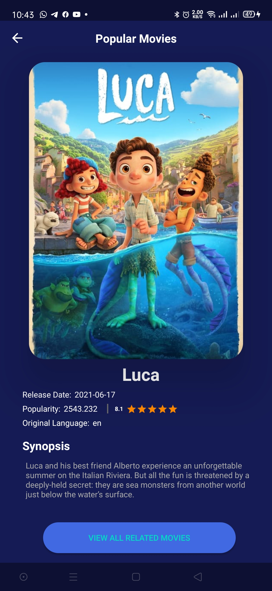
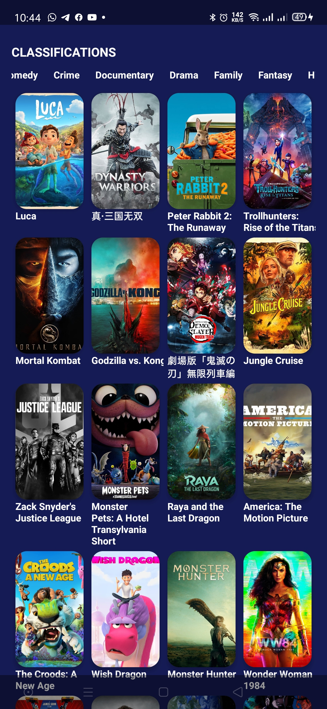
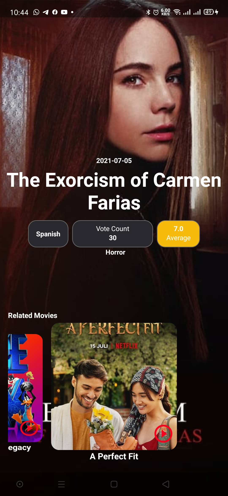
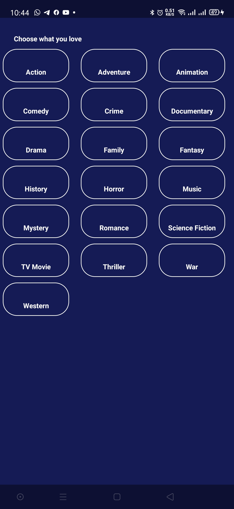

# Movies
An Android app am using [The TMDB API ](https://developers.themoviedb.org/3/getting-started/introduction) to display Movies. Am building it with with clean architecture principles, Repository and MVVM with JetPack Compose Libraries.
Its a work in progress trying to implement all the related libraries on Android using Kotlin and working with the best architecture.

# Architecture
The project uses MVVM architecture pattern.

# Libraries
The Libraries am using in the Development of the whole Application.

* [Jetpack](https://developer.android.com/jetpack)🚀
* [Dagger-Hilt](https://dagger.dev/hilt/) - For dependency injection
* [ViewBinding](https://developer.android.com/topic/libraries/view-binding) - support library that allows binding of UI components in layouts to data sources,binds character details and search results to UI.
* [Navigation Component](https://developer.android.com/guide/navigation/navigation-getting-started)
* [ViewModel](https://developer.android.com/topic/libraries/architecture/viewmodel?gclid=CjwKCAjwjJmIBhA4EiwAQdCbxrvUiq3wgakPX8sop8Kp8irusL4bi_9xCnaiZkUJqBzTbOTB2FB4XRoCujoQAvD_BwE&gclsrc=aw.ds) - Manage UI related data in a lifecycle conscious way and act as a channel between use cases and ui

# Screenshots
This is a short demo of how the application looks like

|||||
|:----:|:----:|:----:|:----:|

||
|:----:|

# Contributions

Contibutions are welcomed. Feel free to add anything or remove anything that is unnecessary

# Support

Give a ⭐ if you like the Project
