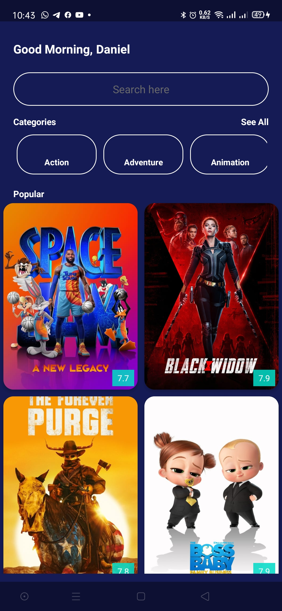

# Movies
This is my first Mobile App. I did with Kotlin

An Android app am using [The TMDB API ](https://developers.themoviedb.org/3/getting-started/introduction) to display Movies. Am building it with with clean architecture principles, Repository and MVVM with JetPack Compose Libraries.

# Prerequisites
Android 9.+ SDK or newer(Required by force dark branch).

# Libraries
The Libraries am using in the Development of the whole Application.

* JetPack Libraries [JetPack Libraries](https://www.googleadservices.com/pagead/aclk?sa=L&ai=DChcSEwik0ZLZ5b7xAhWSYOYKHcNLBO4YABAAGgJkZw&ohost=www.google.com&cid=CAESQOD2qKRX0ODFdfZxyph8EB_4DnR4SXeryJoa-SO7Ty6XGIt6bOI9MONdN7vdy_qPlavyYwe6NI2TyzJzPoN2Eq8&sig=AOD64_0ZNXBHj-FD_cinA0M1HwU8a-G9uw&q&adurl&ved=2ahUKEwim04rZ5b7xAhURERQKHSfZCCcQ0Qx6BAgCEAE)
* ViewBinding
* Navigation Component
* ViewModel
* VideoView

# Screenshots

